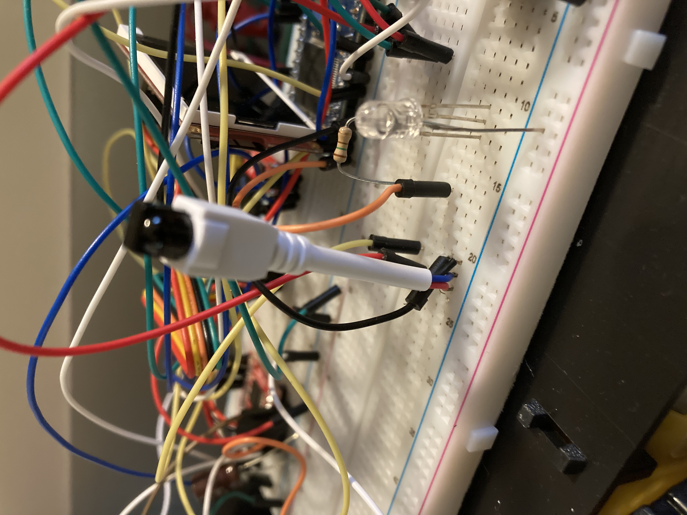

# IRene
Robot that is controlled by an IR remote

## Group Members
Dakota Cobb

## Video Demo
https://www.youtube.com/watch?v=Y6xmmqbI8vc&ab_channel=DakotaCobb

## Idea
To create a fully functioning robot that can move around with any remote and any IR sensor that someone can get their hands on. The remote can be used to do anything a mbed can do with the right hardware. I added an LCD screen, LED and accelerometer to mine, as well as a dual H-bridge for controlling 2 DC motors. 

## Instructions
To set up you will need a IR remote and an IR sensor. IR sensors usually have 3 pins, power, ground, and a data line. Hook this data line to a digital I/O of your choice (I used p15) If you run the main program then it will automatically print the last two hexadecimal numbers to your PC. I used the last two since the last bytes are the ones that change. The ones at the beggining rarely do between button to button. You can do this with TeraTerm on Windows or screen /dev/tty.usbmodem* on mac. If everything is set up correctly you can press a button on the remote and it will print those to hexadecimal numbers to your screen. The last two hexadecimal numbers are stored in buf1[3]. This can be used in conditionals to do pretty much whatever you want. Here I am using it to control which directions motors go to move a robot, but you could use it to control the lights on an led strip or turn on and off lamp or anything you want that you can hook an mbed to.

## Hardware Setup
IR remotes and sensore can be found in lots of places. The most common ones are in TVs so if you have an old TV you are getting rid of you can cut out the IR sensor and keep the TV remote for controlling your robotics. An IR sensor looks like the picture below or you can buy one from amazon here: https://www.amazon.com/Gikfun-avoidance-Reflective-Photoelectric-Intensity/dp/B07FJLMLVZ/ref=asc_df_B07FJLMLVZ/?tag=hyprod-20&linkCode=df0&hvadid=242021018855&hvpos=&hvnetw=g&hvrand=14274926094243320066&hvpone=&hvptwo=&hvqmt=&hvdev=c&hvdvcmdl=&hvlocint=&hvlocphy=9010937&hvtargid=pla-525961642959&psc=1 
IR sensors have 3 pins, power, ground, and a data line. The power can be 5 volts and is usually tolerant to higher voltages like 7 volts, but don't push your luck. 5 volts is the recommended (although it can depend on your sensor). I got this one from an old LED light controller and I measured the voltage that it provided to get the voltage it needed.

### References
https://os.mbed.com/cookbook/IR
